 
  
&emsp;
  

  

  ### :space_invader: **Programming Languages, Frameworks and Libraries**

  | | | | 
  |:-------------------------:|:-------------------------:|:-------------------------:|
  | **Frontend** | **Backend** | **Embedded** |
  |    |  | |

  | | | |
  |:-------------------------:|:-------------------------:|:-------------------------:|
  | **Machine Learning and Data Science** | **Just Scripting** | **Wrote Hello World** |
  |   | |   

  ### :wrench: **Software and Tools**

  | | | |
  |:-------------------------:|:-------------------------:|:-------------------------:|
  | **Coding & Development** | **Hosting & Administration** | **Privacy & Security** |
  |    |   |   

  ---
  ### :computer: **Operation Systems**
  
  | | | |
  |:-------------------------:|:-------------------------:|:-------------------------:|
  | **Ever-Day Usage** | **Pentesting** | **Hosting & Administration** |
  |  | | 

 

 
  
&emsp;<a href="#">
    &emsp;</a>
  

  

  | | | | 
  |:-------------------------:|:-------------------------:|:-------------------------:|
  ||||

:white_heart: <b>Thank You!</b>

  
 

&emsp;[Abhinandan Trilokia](https://github.com/Trilokia): Inspiration for the animated waves

&emsp;[Abdul Khalid](https://github.com/0xabdulkhalid): Inspiration for the section .gif

&emsp;[Jonah Lawrence](https://github.com/DenverCoder1): Readme typing svg
  
&emsp;[Ileriayo Adebiyi](https://github.com/Ileriayo): Markdown bage collection

