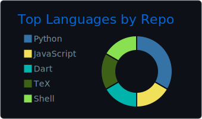
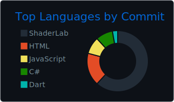

<!-- &emsp;&emsp;&emsp;&emsp;
 -->

 
  
&emsp;
  

  ### :space_invader: **Programming and Markup Languages**

  

      
      
      
      
      
      
      
      
      
      
      
      
      
      
      
      
      
      
      
      
  

  ### :hourglass_flowing_sand: **Machine Learning and Data Science**

  

      
      
      
      
      
      
  

  ### :books: **Frameworks and Libraries**

  

      
      
      
      
      
      
      
      
  

  ### :wrench: **Software and Tools**

  

      
      
      
      
      
      
      
      
      
      
      
      
      
      
  

  ### :computer: **Operation Systems**

  

      
      
      
      
      
      
  

 

 
  
&emsp;<a href="#">
    &emsp;</a>
  

  ###

  
  

    
    
  

:white_heart: <b>Thank You!</b>

  
 

&emsp;[Abhinandan Trilokia](https://github.com/Trilokia): Inspiration for the animated waves

&emsp;[Abdul Khalid](https://github.com/0xabdulkhalid): Inspiration for the section .gif

&emsp;[Jonah Lawrence](https://github.com/DenverCoder1): Readme typing svg
  
&emsp;[Ileriayo Adebiyi](https://github.com/Ileriayo): Markdown bage collection

&emsp;[Simon Lecoq](https://github.com/lowlighter): Awesome metrics generator

